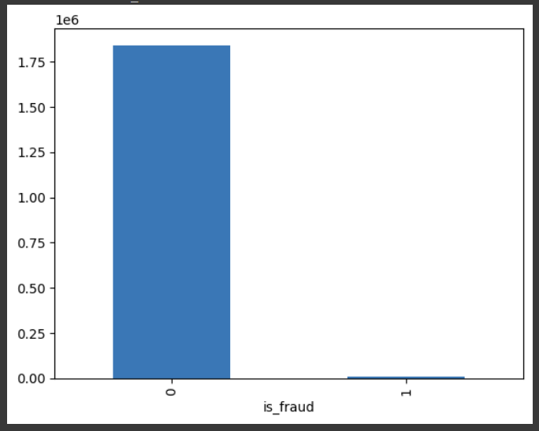

# Credit Card Fraud Detection

## Summary

This project aims to detect fraudulent credit card transactions using a simulated dataset containing transactions from January 1, 2019, to December 31, 2020. The dataset includes both legitimate and fraudulent transactions for 1000 customers interacting with 800 merchants. The goal is to build and evaluate various machine learning models to identify fraudulent transactions effectively.

## Dataset

The dataset was generated using the Sparkov Data Generation tool by Brandon Harris. It consists of:
- **Training Data**: `fraudTrain.csv`
- **Testing Data**: `fraudTest.csv`
- **Combined Dataset**: Merged from training and testing data

### Data Features
- **Transaction Details**: Includes transaction time, amount, and location.
- **Customer Information**: Includes demographic details such as age and location.
- **Merchant Information**: Includes details about the merchant involved in the transaction.

## Data Understanding and Exploration

1. **Loading and Combining Data**: 
   - The data was loaded from CSV files and combined into a single DataFrame.
   - Initial exploration included checking for class imbalance, missing values, and duplicates.

2. **Exploratory Data Analysis (EDA)**:
   - Analyzed the distribution of fraudulent vs. non-fraudulent transactions.
   - Visualized correlations between numerical features.
   - Identified and addressed missing values and duplicates.
     
     


## Data Preparation

1. **Balancing the Data**:
   - To address class imbalance, the dataset was balanced by oversampling the minority class (fraudulent transactions).

2. **Feature Selection and Engineering**:
   - Dropped irrelevant columns (e.g., identifiers, location details) to focus on features that impact fraud detection.
   - Engineered new features from existing data, such as:
     - **Transaction Time**: Converted to hours and categorized into time of day (Morning, Afternoon, Night).
     - **Age**: Calculated from the date of birth.

3. **Label Encoding and Scaling**:
   - Applied one-hot encoding to categorical features.
   - Scaled numerical features using MinMaxScaler.

## Modeling

1. **Model Training and Evaluation**:
   - **Logistic Regression**: Trained and evaluated with different threshold values.
   - **XGBoost**: Trained, evaluated, and fine-tuned with GridSearchCV for hyperparameter optimization.

2. **Evaluation Metrics**:
   - Performance was assessed using accuracy, classification report, confusion matrix, and ROC curve.
   - Models were evaluated based on their ability to correctly identify fraudulent transactions.

3. **Feature Importance**:
   - Analyzed feature importance to understand the impact of different features on model predictions.

## Results

- **Logistic Regression**: Achieved baseline performance with standard and adjusted thresholds.
- **XGBoost**: Improved performance with hyperparameter tuning, showing better predictive capability.

## Model Saving and Deployment

- **Saved Models**: Both the trained XGBoost model and preprocessing pipelines (e.g., one-hot encoder) were saved using `joblib` for future use.
- **Feature Importance**: Extracted and saved feature importance to understand model decisions.

## Acknowledgements

Special thanks to Brandon Harris for creating the Sparkov Data Generation tool, which was instrumental in generating the dataset used for this project.

## Usage

To use the saved models and preprocessing pipelines, load them with `joblib` and apply the same preprocessing steps to new data before making predictions.

```python
import joblib

# Load the models
xgb_model = joblib.load('xgb_model_3.pkl')
encoder = joblib.load('OneHot_encoder_2.pkl')

# Use the models for prediction
